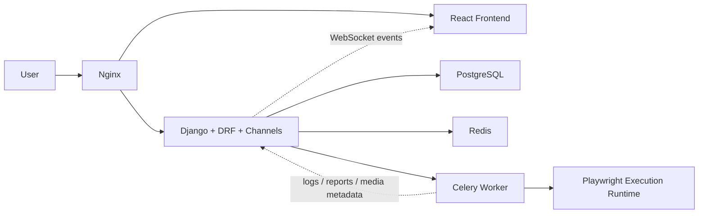
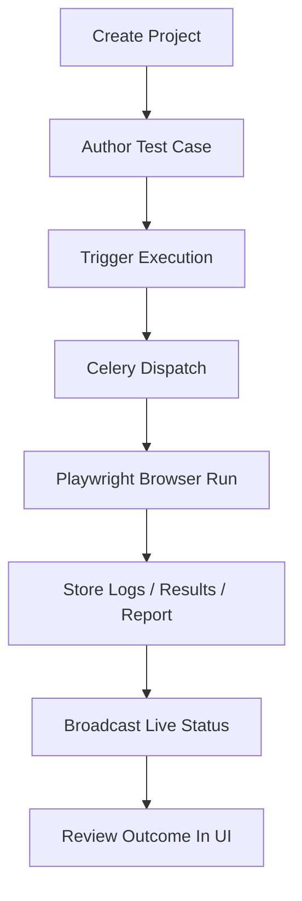

# JX Online Testing Platform


JX Online Testing Platform is a full-stack web application for managing test projects, authoring structured test cases, and running browser-based execution workflows with real-time status updates.

It combines a React frontend with a Django backend, WebSocket-based live execution events, Celery background workers, and a containerized deployment setup built around Docker Compose and Nginx.

## Why This Project

Modern QA workflows often split test management, execution visibility, and deployment into separate tools. This project brings them together in one platform so a team can:

- organize projects and test assets in one place
- define structured, repeatable test case steps
- execute browser-driven workflows asynchronously
- monitor progress in real time
- deploy the entire stack with a reproducible container setup

## Features

- User authentication with JWT
- Project and member management
- Structured test case authoring
- Execution logs, reports, screenshots, and video artifacts
- Immediate and scheduled browser executions
- Seven-day execution trend and pass-rate analytics
- Real-time execution updates over WebSocket
- Containerized deployment with PostgreSQL and Redis
- CI/CD workflows for validation, image build, and deployment

## Tech Stack

- Frontend: React, React Router, Vite
- Backend: Django, Django REST Framework, Channels, Celery
- Data services: PostgreSQL, Redis
- Automation runtime: Playwright Python
- Deployment: Docker, Docker Compose, Nginx, GitHub Actions

## Architecture



## Core Workflow



## Repository Structure

```text
.
├── backend/              # Django, REST API, Channels, Celery
├── frontend/             # React application
├── docker/               # Nginx config and runtime scripts
├── docs/                 # Deployment documentation
├── .github/workflows/    # CI/CD workflows
├── compose.yaml          # Local container stack
└── compose.prod.yaml     # Production image-based stack
```

## Getting Started

```bash
git clone https://github.com/JasperX777/JX-Online-Testing-Platform.git
cd JX-Online-Testing-Platform
```

### Docker Quick Start

```bash
cp .env.example .env
docker compose up --build -d
```

This starts the full local stack:

- frontend
- backend
- Celery worker
- Celery beat scheduler
- PostgreSQL
- Redis
- Nginx

Key endpoints:

- Application: `http://localhost`
- Health check: `http://localhost/api/health/`

### Frontend

```bash
cd frontend
npm ci
npm run dev
```

### Backend

```bash
cd backend
./.venv/bin/python manage.py migrate
./.venv/bin/python manage.py runserver
```

### Background Worker

```bash
cd backend
./.venv/bin/celery -A config worker --loglevel=info
./.venv/bin/celery -A config beat --loglevel=info
```

By default:

- Frontend runs on `http://localhost:5173`
- Backend runs on `http://localhost:8000`
- Vite proxies `/api`, `/ws`, and `/media` to the backend

## Docker Deployment

```bash
cp .env.example .env
docker compose up --build -d
```

## Quality Gates

Frontend:

```bash
cd frontend
npm run lint
npm run test
npm run test:e2e
npm run build
```

Backend:

```bash
cd backend
./.venv/bin/coverage run manage.py test --settings=config.settings.test
./.venv/bin/coverage report
./.venv/bin/python manage.py check --deploy --fail-level WARNING --settings=config.settings.prod
```

## CI/CD

- Continuous integration: [`.github/workflows/ci.yml`](.github/workflows/ci.yml)
- Build and deployment pipeline: [`.github/workflows/deploy.yml`](.github/workflows/deploy.yml)
- Production compose file: [`compose.prod.yaml`](compose.prod.yaml)

The pipeline validates frontend and backend changes, builds container images, publishes them to GHCR, and can deploy the stack to a remote server over SSH.
CI also audits Python and Node dependencies, enforces backend and frontend coverage thresholds, runs the mocked full-user workflow across Chromium, Firefox, and WebKit, and verifies a real Django-to-browser-executor integration workflow. Dependabot checks dependency updates weekly.

## Use Cases

- QA teams who want lightweight in-house test management plus execution tracking
- full-stack learning projects that combine React, Django, WebSocket, Celery, and container deployment
- portfolios that need a realistic example of asynchronous job processing and browser automation

## Documentation

- Frontend notes: [frontend/README.md](frontend/README.md)
- Backend notes: [backend/README.md](backend/README.md)
- Deployment guide: [docs/deployment.md](docs/deployment.md)
- Quality assurance record: [docs/quality-assurance.md](docs/quality-assurance.md)
